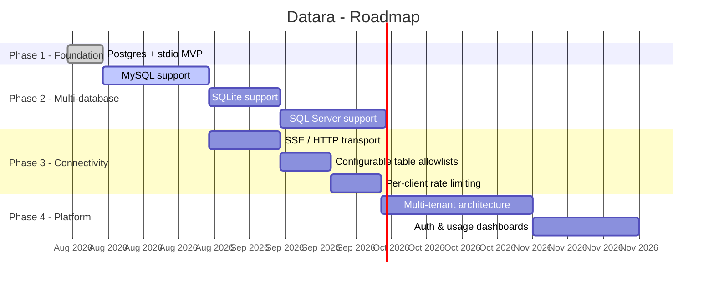

# 🗺️ Datara Roadmap

This document tracks where Datara is headed from a single-database CLI tool to a multi-tenant SaaS data gateway. It's a living document: phases may be reordered or reshaped as real usage informs priorities.

---

## Guiding principles

Every feature added to Datara is evaluated against three questions:

1. **Does it strengthen the security guarantee?** Read-only enforcement is the core value proposition — nothing ships that weakens it, even implicitly.
2. **Does it keep the binary simple to deploy?** A single static binary with near-zero footprint is a deliberate constraint, not an accident.
3. **Does it generalize across database engines?** Anything built for Postgres should be structured so the same capability is cheap to add for MySQL, SQLite, or SQL Server later.

---

## Progress overview

---

## Phase 1 - Foundation ✅

**Status: shipped**

The core value proposition, proven end-to-end: an AI agent can query a private Postgres database through MCP without any risk of writing to it.

- [x] AST-based SQL validation via `pg_query_go` single `SELECT` statements only
- [x] Rejection of `SELECT ... INTO`, locking clauses, and stacked (multi-)statements
- [x] Postgres datasource implementation (`pgx/v5`)
- [x] Hand-rolled MCP `stdio` transport (JSON-RPC 2.0: `initialize`, `tools/list`, `tools/call`)
- [x] Structured JSON audit logging (blocked + executed queries) on stderr
- [x] `MaxRows` truncation to bound response size on large tables
- [x] Unit test suite covering the security-critical validation paths
- [x] CI (GitHub Actions: build + test)
- [x] Verified against a real Postgres instance through Claude Desktop

---

## Phase 2 - Multi-database support 🔜

**Goal:** prove the `DataSource`/`SQLValidator` port abstraction by adding engines beyond Postgres without touching the security core or the transport layer.

| Engine | Parser strategy | Status |
|---|---|---|
| MySQL | AST validation via a MySQL-aware parser (e.g. `pingcap/tidb/parser`) | Planned |
| SQLite | AST validation via `sqlite3-parser` or equivalent | Planned |
| SQL Server (T-SQL) | AST validation via a T-SQL-capable parser | Planned |

Each engine ships as:
- one new package under `internal/datasource/<engine>/` implementing `ports.DataSource`
- one new package under `internal/security/astvalidator/<engine>/` implementing `ports.SQLValidator`

No changes to `internal/core`, `internal/transport`, or `internal/audit` should be required that's the test of whether Phase 1's architecture actually holds up.

---

## Phase 3 - Connectivity & hardening

**Goal:** make Datara deployable in more environments and safer to expose more broadly.

- [ ] **`SSE`/HTTP transport** - for web apps (Next.js) and cloud microservices that can't spawn a local subprocess the way Claude Desktop or Cursor do.
- [ ] **Configurable table/column allowlists** - today's `SecurityPolicy.AllowedTables` is enforced at the table level; extend it to column-level restrictions and load policies from a config file instead of hardcoding them.
- [ ] **Per-client rate limiting** - cap query volume per API key/connection to prevent runaway agents from hammering the database.
- [ ] **Query timeout enforcement** - bound execution time per query, independent of `MaxRows`.
- [ ] **Structured error taxonomy** - distinguish policy rejections, parse errors, and database errors in the audit log for easier alerting.

---

## Phase 4 - Platform

**Goal:** evolve from a self-hosted CLI binary into a multi-tenant SaaS offering, without abandoning the open-source core.

- [ ] **Multi-tenant architecture** — tenant-scoped `SecurityPolicy` and connection pooling, built on top of the existing Clean Architecture boundaries rather than a rewrite.
- [ ] **Authentication** - API keys or OAuth for SSE-mode clients.
- [ ] **Usage dashboards** - surface the audit log (blocked vs. executed queries, per tenant) as a hosted UI.
- [ ] **Billing integration** - usage-based pricing tied to query volume.

This phase is intentionally the least detailed: it depends on real usage patterns from Phases 1–3, and premature design here would be guessing.

---

## Non-goals

To keep Datara focused, the following are explicitly out of scope for the foreseeable future:

- **Write access, under any configuration.** Datara is a read-only gateway by design if a use case needs writes, it needs a different tool, not a policy flag on this one.
- **A query builder or ORM layer.** Datara validates and executes SQL; it doesn't help anyone write it.
- **Support for NoSQL databases.** The AST-validation approach is inherently SQL-specific; a MongoDB/DynamoDB story would need a fundamentally different security model.

---

## Contributing to the roadmap

This roadmap reflects current priorities, not commitments. If you're using Datara and a phase ordering doesn't match your needs, open an issue — real usage is the best input this document can get.